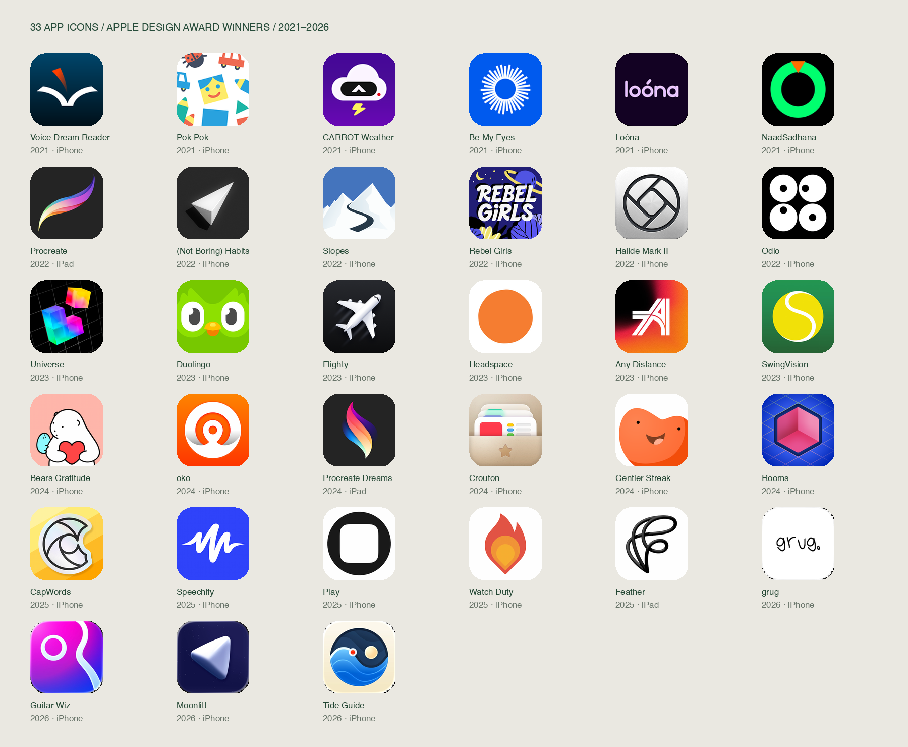

# Cosmo app icon: research and five directions

September 5, 2026 · Flat vector study

## Recommendation

**Develop 02 Verdant as the primary direction.** It keeps the forest-green ink, parchment, orbit, leaf, and central seed, but gives them a more confident silhouette. Its broad lower sweep balances the fine upper orbit; the leaf becomes a single readable countershape. **05 Evergreen** is the stronger dark presentation. **01 Living Orbit** is the conservative choice if continuity matters most.

The opportunity is to make Cosmo’s existing idea feel deliberately drawn. More texture or simulated depth would not resolve the weak small-size hierarchy. These five proposals use flat fills and editable curves throughout.

## What was researched

I visually inspected **33 distinct Apple Design Award-winning app icons** from Apple’s 2021–2026 award pages: 30 iPhone references and three iPad-only creative tools. Games and entries awarded for a visionOS-only experience were excluded. Each reference is preserved in `research/`, with its award page, artwork URL, and available App Store link in `research/sources.json`.

This is a curated design study, not a statistical sample or an icon-specific award ranking. Apple awards the complete app experience. The observations below are my visual analysis of the artwork displayed on those pages; archived artwork need not match the app’s current installed icon. Awards establish the reference set, not a causal claim that any particular icon style wins awards.

## Lessons that matter for Cosmo

- **A simple idea needs an unmistakable contour.** Headspace, Play, and Odio use very little visual information. Their scale, spacing, and figure–ground relationships do the work. Cosmo can remain restrained while becoming more recognizable.
- **An ownable curve is more useful than extra detail.** Speechify’s wave and the Procreate family’s sweeps feel drawn for their brands. Cosmo’s orbit should have a similarly deliberate rhythm.
- **The icon should make an emotional promise.** Gentler Streak and Bears Gratitude communicate warmth before their apps open. Cosmo’s leaf is valuable because it softens an otherwise scientific orbit into an idea of cultivated knowledge.
- **Depth is a choice, not a requirement.** Flighty, Crouton, and Halide use dimensional cues effectively; Headspace and Play demonstrate that strong flat identities coexist in the same award set. For this brief, the useful lessons are silhouette and proportion.
- **Inspect the reduction, not only the master.** Small veins, crowded crossings, and weak strokes can vanish or merge. The proof board includes 60, 40, and 29 pixel renderings. These are visual reduction tests, not an exhaustive list of iOS output slots.

## Original icon diagnosis

**Keep:** the diagonal orbital movement; the central point of focus; the leaf as growth; green on warm paper; generous breathing room. Together these already express a living knowledge workspace.

**Improve:** the main orbit has nearly the same weight as the leaf’s internal structure. At small sizes the right-hand junction becomes the densest area, while the rest of the symbol is quite light. The orbit, leaf, and dot need clearer relative emphasis. The parchment texture adds atmosphere at large size but contributes little to recognition on the Home Screen.

**Drawing approach:** retain the meaning, tighten the curves, enlarge the visual mass selectively, and resolve the right-hand leaf into fewer shapes. Use the same geometry for light, dark, and monochrome proofs. Check the mark as a silhouette so the identity does not depend on color or grain.

## Five proposals

| Direction | What changes | Best use | Tradeoff |
|---|---|---|---|
| **01 Living Orbit** | Reinforces the two existing orbits, enlarges the seed, simplifies the leaf | Lowest-risk evolution of the current icon | Still the most intricate at 29 pixels |
| **02 Verdant** | A broad rising sweep, slender secondary orbit, and decisive leaf | Recommended primary identity | More organic; less like a scientific diagram |
| **03 Folio** | An orbital C with a leaf and horizontal connecting gesture | A more editorial, monogram-led identity | Moves further from the original two-loop shape |
| **04 Meridian** | A tall measured orbit with a muted gilt seed | A scholarly, contemplative alternative | The third color is an accent, not a recognition cue; the fine orbit remains delicate |
| **05 Evergreen** | A continuous broad orbital ribbon in parchment on deep forest | Strong dark presentation and Home Screen presence | Greater visual weight than the quiet original |

All five have default, dark, and single-ink proof files. The single-ink proofs test geometry; they are **not** verified system-generated iOS tinted appearances.

## Reference notes

### 2021 — six app winners

Award source: [Apple Design Awards 2021](https://developer.apple.com/design/awards/2021/).

| App | Observation | Application to Cosmo |
|---|---|---|
| Voice Dream Reader | Open-book silhouette, dark field, and one orange directional accent | A small second color can prioritize one meaningful element |
| Pok Pok Playroom | Flat toy shapes create an unmistakably playful visual world | Match the emotional tone of the product; avoid unrelated decoration |
| CARROT Weather | A compact character combines a familiar cloud with a distinctive visor | Familiar category cues become memorable through one custom feature |
| Be My Eyes | A radial symbol remains centered and coherent despite many rays | Let repeated geometry serve a single focal point |
| Loóna | A short lavender wordmark sits in a generous dark field | Negative space can communicate calm; a wordmark is not necessary here |
| NaadSadhana | One large green ring and orange wedge dominate the black square | Strong mass and a single interruption can establish identity |

### 2022 — six app winners

Award source: [Apple Design Awards 2022](https://developer.apple.com/design/awards/2022/).

| App | Observation | Application to Cosmo |
|---|---|---|
| Procreate · iPad | A tapered colorful brush sweep reads as one silhouette | Make the orbit feel intentionally drawn rather than mechanically uniform |
| (Not Boring) Habits | A white dimensional arrow occupies a restrained dark field | Borrow focus and contrast; its 3D material is outside this brief |
| Slopes | A dark winding route doubles as an S between mountains | Merge meanings into one shape rather than accumulating separate symbols |
| Rebel Girls | Bold lettering and illustration produce an energetic editorial identity | Richness can work, but this density conflicts with Cosmo’s calm tone |
| Halide Mark II | A precise circular camera emblem organizes complex internal geometry | Intersections and line discipline can carry perceived craft |
| Odio | Four large white discs with small black offsets create a graphic rhythm | Reduce to clear masses before adding finer structure |

### 2023 — six app winners

Award source: [Apple Design Awards 2023](https://developer.apple.com/design/awards/2023/).

| App | Observation | Application to Cosmo |
|---|---|---|
| Universe — Website Builder | Vivid modular blocks imply construction and possibility | A composition can express the product’s idea without a literal tool icon |
| Duolingo | A tightly cropped, bright mascot makes the square itself part of the face | Scale the hero confidently; recognition should precede detail |
| Flighty | A strong aircraft diagonal is isolated against charcoal | The diagonal gesture is worth retaining in Cosmo |
| Headspace | An imperfect orange disc carries the entire identity | Character can come from proportion and contour alone |
| Any Distance | A custom linear monogram stands against a saturated corner glow | Refine the mark’s geometry before considering background effects |
| SwingVision | A tennis ball’s seam becomes a clear S | Integrate the Cosmo initial only when it supports the original metaphor |

### 2024 — six app winners

Award source: [Apple Design Awards 2024](https://developer.apple.com/design/awards/2024/).

| App | Observation | Application to Cosmo |
|---|---|---|
| Bears Gratitude | A friendly character and heart immediately establish tenderness | Preserve the humane, growing quality of the leaf |
| oko | A centered circular symbol is emphatic against orange | Strengthen the main shape before adding ornament |
| Procreate Dreams · iPad | A flowing flame-like sweep extends the Procreate family | Related identities can evolve through shared movement rather than identical geometry |
| Crouton | A tidy recipe holder communicates collection and organization | A tangible metaphor can convey purpose; avoid importing its dimensional style |
| Gentler Streak | A large warm character creates an approachable silhouette | Warmth is a brand asset, not something to remove in pursuit of premium |
| Rooms | A colored cube and grid establish a spatial world | Product meaning should guide visual structure; avoid a generic decorative grid |

### 2025 — five app winners

Award source: [Apple Design Awards 2025](https://developer.apple.com/design/awards/2025/).

| App | Observation | Application to Cosmo |
|---|---|---|
| CapWords | A cut, aperture-like C merges the initial with the camera metaphor | A Cosmo C should also retain orbit and growth |
| Speechify | A high-contrast custom wave turns sound into a memorable signature | A carefully shaped curve can be both simple and distinctive |
| Play | A black circular mass with a soft square void is radically compact | Test recognition through positive and negative shapes alone |
| Watch Duty | Nested warm shapes reinforce a single flame silhouette | Color can enrich one coherent idea without adding a new symbol |
| Feather: Draw in 3D · iPad | A looping black stroke makes the drawing gesture the identity | Orbital linework can be expressive; keep Cosmo’s treatment flat |

### 2026 — four app winners

Award source: [Apple Design Awards 2026](https://developer.apple.com/design/awards/).

| App | Observation | Application to Cosmo |
|---|---|---|
| grug | A small handwritten wordmark has an intentionally informal voice | Award recognition does not imply a single premium visual style |
| Guitar Wiz | A circular cutout and curved edge suggest an instrument with few shapes | A carefully placed void can express the object |
| Moonlitt | A pale directional form is isolated on a deep blue field | Direction and contrast remain legible before surface detail |
| Tide Guide | Wave bands and a celestial disc form a compact circular scene | Orbit and nature can coexist within a disciplined emblem |

## Production handoff and limits

- `svg/`: five editable vector masters, each in default, dark, and single-ink appearances. No raster content, fonts, filters, gradients, or external resources.
- `png/`: corresponding opaque RGB 1024 × 1024 exports. The source square is full bleed; rounded corners are applied only in presentation previews.
- `comparison.png`: original and five proposed icons, with small-size proofs.
- `research/`: reference artwork and source records, for study only. Third-party icons are not Cosmo assets.
- `build-icons.cjs` and `build-board.cjs`: reproducible vector definitions and proof generation.

Apple’s current guidance calls for a square source, system-applied masking, simple recognizable imagery, and checking appearance variations. Its current icon workflow also supports layered artwork and system effects. These flat proposals establish the graphic identity; final Icon Composer integration and on-device light/dark/tinted/clear validation remain a separate production step after selecting a direction. [Apple: App icons](https://developer.apple.com/design/human-interface-guidelines/app-icons).

Validation here covers source structure, opaque 1024-pixel exports, and visual inspection at multiple sizes and in dark presentation. It does not establish audience preference, trademark clearance, or an award outcome. The installed application icon and Xcode asset catalogs have not been changed.
